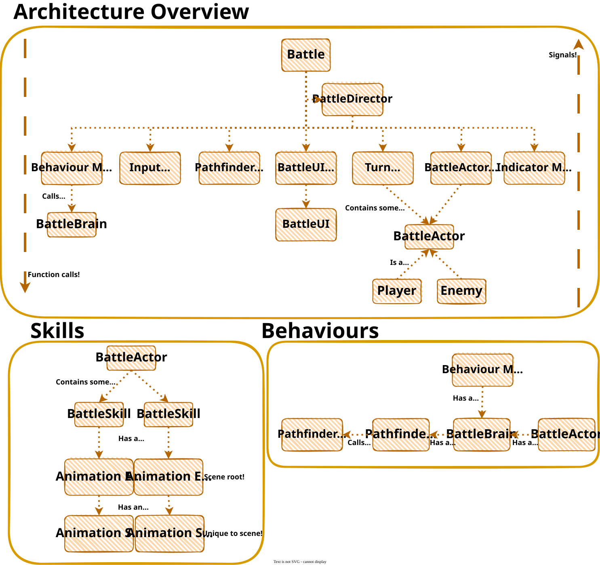

# Turn Based Prototype
A protoype for something turn-based in Godot!

## Contents

- [BattleAssets](#assets)
- [Battle](#world)
- [BattleDirector](#BattleDirector)
- [BattleUI](#ui)
- [Managers](#managers)
  - [Turn Manager](#turn-manager)
  - [BattleUI Manager](#ui-manager)
  - [Pathfinder Manager](#pathfinder-manager)
  - [Input Manager](#input-manager)
  - [BattleActor Manager](#actor-manager)
  - [Indicator Manager](#indicator-manager)
  - [Behaviour Manager](#behaviour-manager)
- [BattleActor](#actor)
- [Player](#player)
- [BattleSkill](#skill)
- [Animaton Event](#animation-event)
  - [Animation Event Script](#animation-event-script)
  - [Animation Event Context](#animation-event-context)
- [BattleBrain](#BattleBrain)

## BattleAssets

Preloads assets (scenes and resources) required by the game.

## Battle

The world represents...a world! It's a Node2D, and your scene root. It contains your [Managers](#managers) and [BattleActor Tracker](#Actor_Tracker) as nodes, which are added automatically during startup. It then starts processing turns!

## BattleDirector

Coordinates everything! Any signals received by the world from managers are forwarded to the BattleDirector. The BattleDirector then uses the state of the other managers to determine the action, and direct them!

## BattleUI

Contains the user interface itself! Is responsible for signalling up when things happen, it is controlled by the [BattleUI Manager](#ui-manager).

## Managers

### Turn Manager

It manages your turns! The turn manager contains references to actors that need their turn managed. They can be registered, and upon registering the turn manager connects to their `turn_finished` signal.

Then, it will continously loop over all actors. Each turn it will await for the actor to
emit a signal informing the manager that it's turn has ended. Then it moves on to th next actor!

### BattleUI Manager

It manages your BattleUI! The BattleUI manager should be called by the [Battle](#Battle) whenever a BattleUI change is required. The [Battle](#Battle) will receive updates from it's various managers and trackers via signals, and determine when it needs to call down to the BattleUI manager. The BattleUI manager instantiates and controls the [BattleUI](#ui-manager), reporting upwards using a signal when BattleUI interactions occur, for the BattleDirector to react to.

### Pathfinder Manager

It manages your paths! The pathfinder manager registers all `TileMapLayer` nodes that have the [Battle](#Battle) as a direct parent. It then builds an `AStarBattleGrid2D` from this. All tiles in the `TileMapLayer` that have the value `true` in the `boolean` custom data layer named `"solid"`, will be marked as solid! It can then be used by calling `get_cell_path` to obtain a path between two cell coordinates, if one exists.

### Input Manager

Manages your inputs!

### BattleActor Manager

It manages your actors! The actor manager contains references to actors that need their positions tracked.
Actors can be registered, and upon reigstering the actor manager connects to the actor's various signals. It can be used to obtain information about all actors. For example, it's useful when actors need to know where other actors are! It also receives an event when an actor is eliminated!

### Indicator Manager

Manages indicators that exist in world space, like the ones showing the currently selected cell, a path or
where an actor is able to move to on this turn.

### Behaviour Manager

Manages behaviours of actors that are not player controlled. Delegates decision making to the actor's [BattleBrain](#BattleBrain).

## BattleActor

The base class for everything that 'acts' in the turn manager!

## Player

The player!

## BattleSkill

Represents a skill usable by an actor. This is a resource so remember it is shared by reference. Each actor has an array of references to skills.

## Animation Event

Represents a 'canned' animation! It can be played, using `await` to wait for it to finish playing. An Animation Event should be a scene root node that can then be instantiated when you want to play it. You might have a scene to represent throwing a rock for example!

### Animation Event Script

This contains the actual script that runs the animation in an animation event. It is unique to the scene.

### Animation Event Context

A resource that is passed to an animation to give it context (e.g. a target, source, or other parameter required by the animation).

## BattleBrain

A BattleBrain is used by a non-player controlled actor to decide on an action. You can extend BattleBrain to create
your own logic, create a new BattleBrain type resource, and then assign the BattleBrain to any actor. The BattleBrain
receives a world state and a pathfinder each time it needs to decide an action, to use in deciding what
that action is.